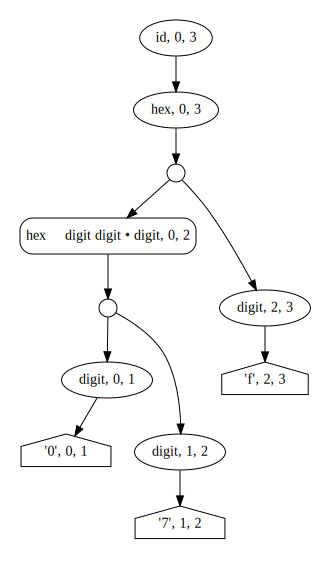
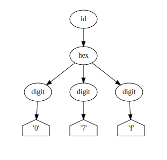
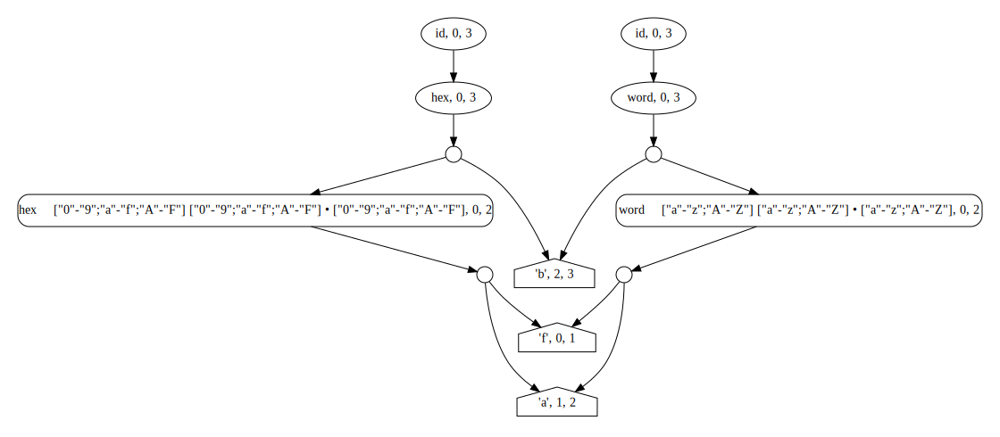
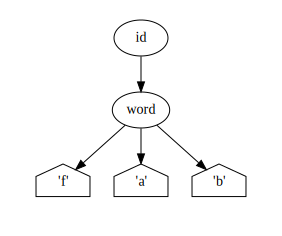
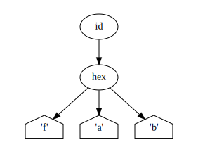

# Example 1, a simple example

Consider an utterly contrived example where we say that an “id” can be
either a word or a hexidecimal number. For the moment, we’re going to
require that it be exactly three characters long, we’ll come back to that in
the next example.

Informally, we might write a grammar for ids like this:

```
id => word; hex
word => letter, letter, letter
hex => digit, digit, digit
letter => ["a"-"z"; "A"-"Z"]
digit => ["0"-"9"; "a"-"f"; "A"-"F"]
```

You can create a parser for this grammar with the API.

Create a grammar:

```
Grammar grammar = new Grammar();
```

Use the grammar to create nonterminals.

```
NonterminalSymbol id = grammar.getNonterminal("id");
NonterminalSymbol word = grammar.getNonterminal("word");
NonterminalSymbol hex = grammar.getNonterminal("hex");
```

Create the terminals. Terminals are composed from `Token`s. The API
supports several kinds of tokens out of the box, including tokens that
match a selected range of characters (or the inverse of such a range).

```
CharacterSet set_0_9 = CharacterSet.range('0', '9');
CharacterSet set_a_f = CharacterSet.range('a', 'f');
CharacterSet set_A_F = CharacterSet.range('A', 'F');
CharacterSet set_a_z = CharacterSet.range('a', 'z');
CharacterSet set_A_Z = CharacterSet.range('A', 'Z');

TerminalSymbol letter = new TerminalSymbol(TokenCharacterSet.inclusion(set_a_z, set_A_Z));
TerminalSymbol digit = new TerminalSymbol(TokenCharacterSet.inclusion(set_0_9, set_a_f, set_A_F));
```

Construct grammar rules that specify how nonterminals are defined.

```
grammar.addRule(id, word);
grammar.addRule(id, hex);
grammar.addRule(word, letter, letter, letter);
grammar.addRule(hex, digit, digit, digit);
```

Finally, create a parser and parse a string.

```
EarleyParser parser = grammar.getParser("id");
EarleyResult result = parser.parse("07f");
```

The `EarleyResult` returned is a forest of all the possible parses:



The nodes in the forest are mixture of terminals, nonterminals, and states from the Earley parse.

You can get the parse trees from the forest, by calling `parse()`:

```
ParseTree tree = result.getForest().parse();
```

Trees are composed of terminals and nonterminals:



For unambiguous parses, the forest isn’t all that interesting. But
Earley grammars aren’t required to be unambiguous. Consider what it
means to parse `fab` with this grammar. That could be either a word or hex number.
This is reflected in the graph:



(In this case, the ambiguity occurs at the root, but it can occur in other places.)

The `getTotalParses()` method on the forest will tell you how many parses exist.
Here’s the first:



Here’s the second:



Trees are managed by the `TreeWalker` and `TreeBuilder` classes. The
default tree walker returns them all in a pre-order traversal of the
graph. You could extend the classes to support other algorithms.

